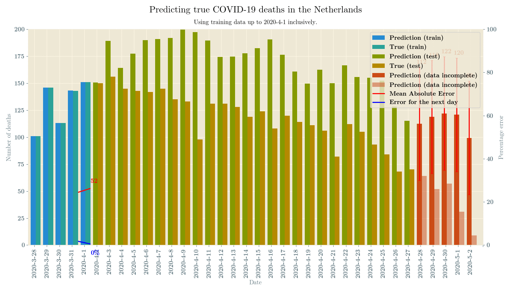

COVID Prediction
================

Dutch RIVM data on corona-related deaths in the Netherlands is updated every
day around 14:00 local time. Unfortunately, this data is often incomplete,
with many deaths being added over time. This makes the data less reliable.

This project
------------

This project automatically downloads data from the *RIVM* and parses the relevant
table from the PDF. It combines this data with data from *NICE*, the association
for National Intensive Care Evaluation. This data is then used to predict the true
death rate based for the day before the latest report. 

 

To run this project
-------------------

Run the spider to download all the PDF files from the RIVM. Some files have 
been overwritten lost on the RIVM, so you can email me to obtain these all 
the files since 29/3/2020. (me [AT] stephanheijl.com)

`scrapy runspider scraper.py`

Next, parse all the tables from the PDF files:

`python3 parse_pdf.py`

Then run this Python script to build a model and output an image:

`python3 true_death_rate.py`

You can change the regression algorithm by looking for the line below:

`# >>> Experiment with your own regressor here <<<`

To create the animation above:
------------------------------
You will need to create all the plots and include data from previous runs,
so you need to run the plot process twice.

```
seq 5 26 | xargs -i python3 true_death_rate.py {}
seq 5 26 | xargs -i python3 true_death_rate.py {}
convert -delay 50 -loop 0 `ls plots/*.png | sort -t'-' -k2 -k3 -n` animation.gif
```

